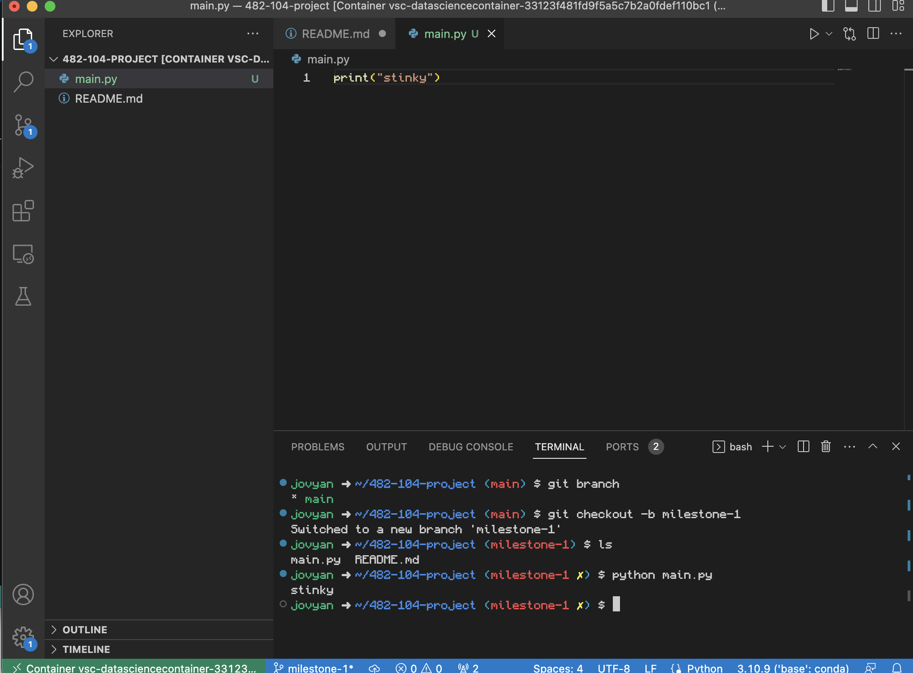
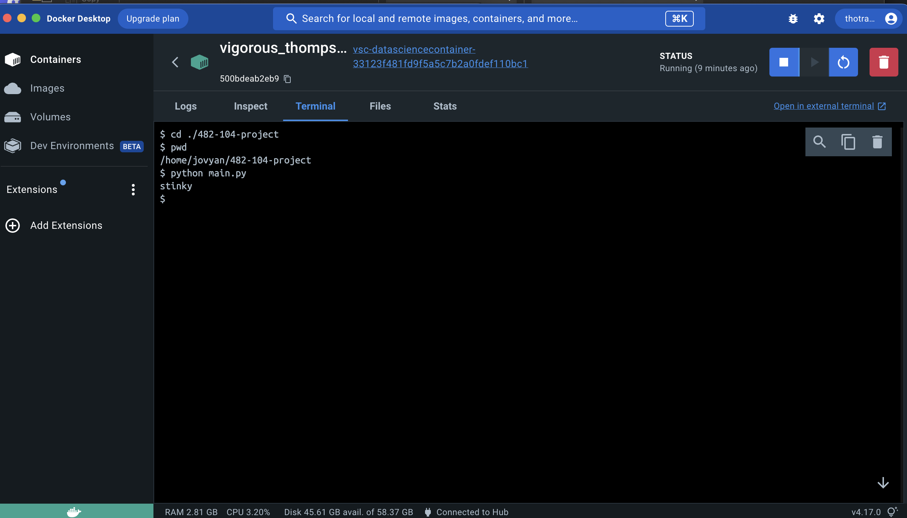

# 482-104-project
I followed the tutorial on how to setup a dev container in order to create a remote container, the installation process of docker, and watch the video tutorial on the docker basics. Still unsure on how to set up the container myself without the extension and earlier i was able to create my own docker image that when ran printed hello world. I didnt know exactly what kind of screen shoot to attach so i attached the terminal in vscode and the docker desktop terminal 
### Vscode terminal running main.py

### Docker Desktop terminal running main.py
